# zebra_zpl_autoexec_font_lpt_ad
Utilidade pública - Manager Zebra print. Script de inicialização, envio de fonte, instalação na LPT1 em ambiente AD.


# Script de inicialização.

Para que as fontes sejam selecionadas por padrão ao ligar a impressora, é necessário adicionar um arquivo AUTOEXEC.zpl na memória flash da impressora.
 

No painel web, acesse: **Listagem de diretórios**

A Impressora Zebra possuí 2 memórias, RAM e Flash, todos os arquivos de configuração devem estar dentro da memória Flash, dispositivo E:

 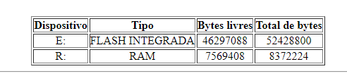


**Iremos utilizar as fontes**: TAH000.ttf e TAH001.ttf
 
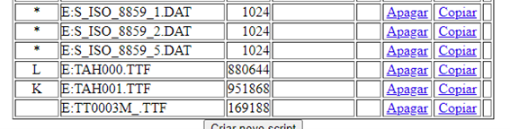
 

 Crie um novo Script na memória Flash integrada.

nome: ativa_fonte.zpl

 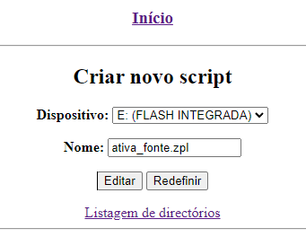

```

^XA
^CWL,E:TAH000.TTF
^CWK,E:TAH001.TTF
^XZ

```

Ex:

^XA = Inicia um bloco de comando ZPL.

^CWL,E:TAH000.TTF = Coloca a Identificação L na fonte TAH000.TTF que está localizada em E:

^CWK,E:TAH001.TTF = Mesma explicação. Comando utilizar as fontes marcadas com L ou K

^XZ = Finaliza o bloco zpl

 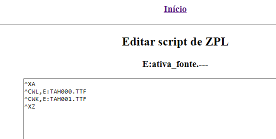

 **Crie outro script chamado AUTOEXEC.zpl para iniciar o arquivo ativa_fonte.zpl**

AUTOEXEC.ZPL

```
^XA
^XF E:ativa_fonte.zpl^FS
^XZ

```

 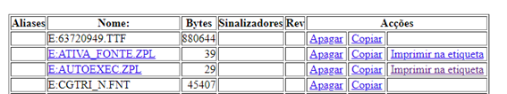

Realize os testes após desligar e ligar a impressora.


--------------------------


# Enviando fonts para impressora zebra.


Abra o Zebra Setup Utilites.

Selecione a impressora > Escolha a opção Download Fonts and Graphics

Salve um novo arquivo *.mmf*

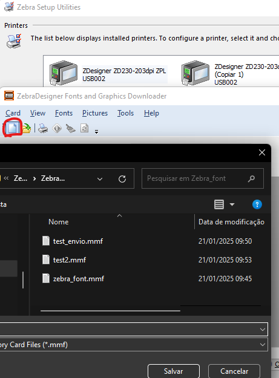
 
Escolha uma opção de tamanho de Card adequada para sua fonte.

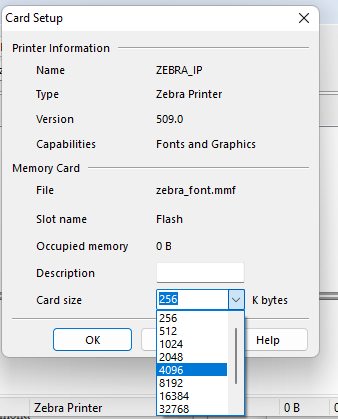
 
No campo Fonts, click botão direito e Add...

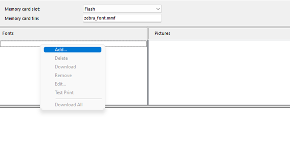
 
Faça o Processo de selecionar a fonte desejada, A fonte precisa está instalada no Windows, caso contrário, irá ter que enviar como arquivo.
 
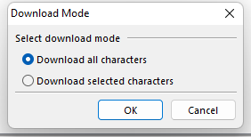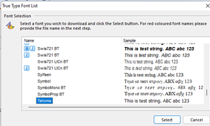
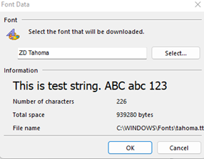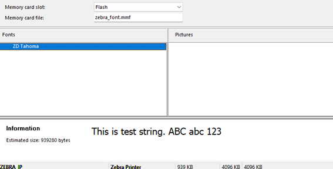

 

Faça o Download para enviar para impressora.
 
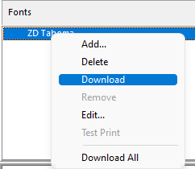

Arquivos também podem ser enviados para impressora através do Driver.
Propriedades da impressora > Preferências...> Tools > Action > Send File.

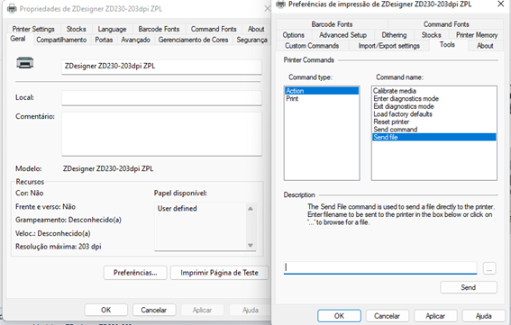
 
 -------------------------------------------------

# Utilizando Porta USB como LPT1.

O Host está ingressado no AD, portanto, o usuário não possuí permissão para executar scripts.

1º - Instale o Driver com o usuário Administrador.

2º - Compartilhe a impressora instalada, ex: zebra_compartilhada.

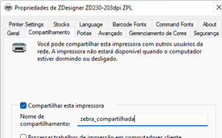

Acesse \\\127.0.0.1 para verificar o compartilhamento.

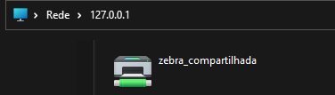

Para usar a porta USB como LPT1, podemos utilizar o net use pelo cmd para jogar os dados de lpt1 no compartilhamento zebra_compartilhada.

*net use lpt1: \\\127.0.0.1\zebra_compartilhada /persistent:yes*

**OBS:** Se você utilizar o comando como ADM, a porta lpt1 será atribuída apenas ao seu usuário ADM.

No AD, o usuário comum irá necessitar das credenciais Administradoras para poder conceder acesso na porta LPT.

Para contorna isso, utilize o Agendador de tarefas.

3º - Abra o **taskschd.msc**

Importe o arquivo já configurado: Inicia_ltp1.xml.

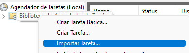


Presets:

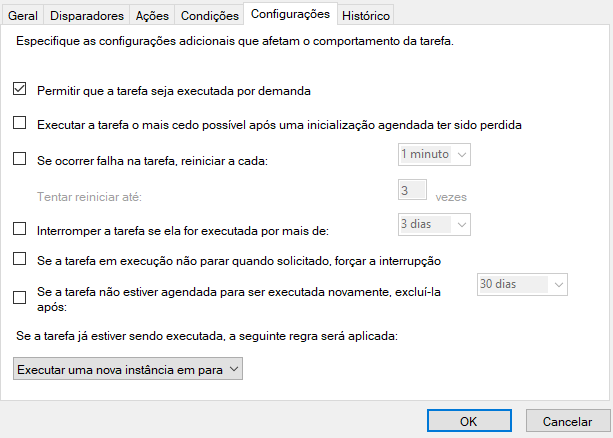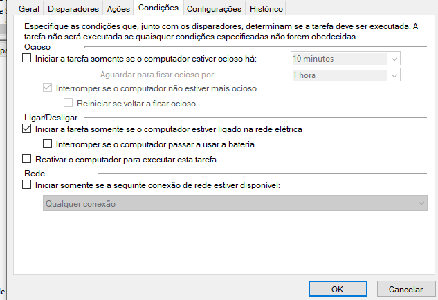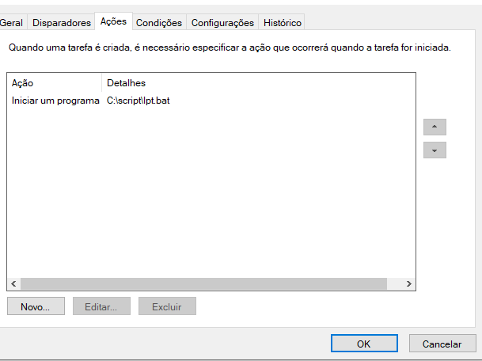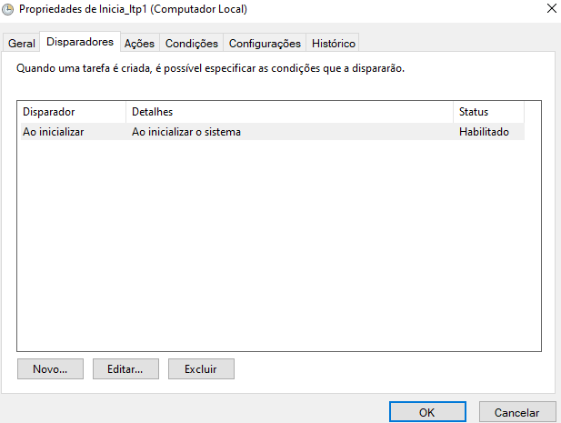

*Deixe o diretório "Scripts" em C:*

O Agendador irá inicializar o script lpt1.bat toda vez que o computador inicializar. O script será executado com permissões de Administrador pelo taskschd.msc.


Teste a porta lpt1. Após o computador ser reinicializado, verifique se consta no "net use".

**Instale uma nova impressora pela LPT1.**

Adicione uma impressora como Local e adicione a porta LPT1.

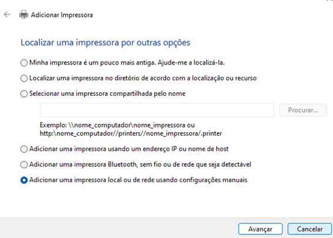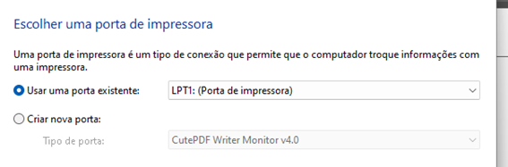

Para deletar a porta: *net use LPT1: /delete*

OBS: Caso algo de errado, verifique se exista algo que possa atrapalhar os drivers da impressora, exemplo: antivírus ou atualização do Windows quebrada, ex: KB3118754...


